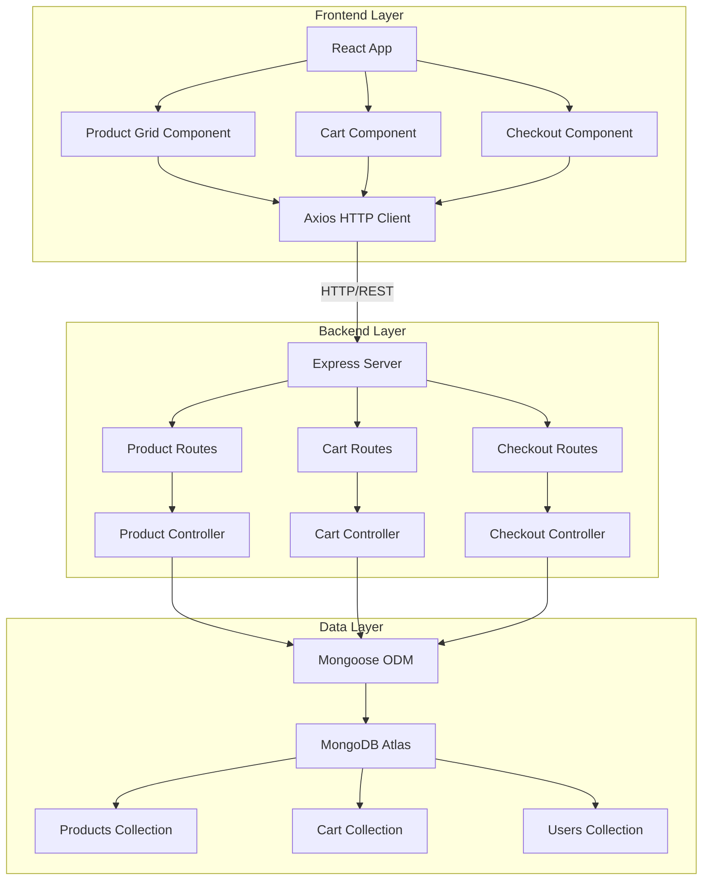

# Design Document

## Overview

Vibe Commerce is a full-stack e-commerce application following a three-tier architecture: React frontend, Express.js REST API backend, and MongoDB database. The system uses a RESTful API design pattern with clear separation of concerns through controllers, routes, and models. The frontend communicates with the backend via Axios HTTP client, and the backend manages data persistence through Mongoose ODM.

## Architecture

### System Architecture Diagram



### Technology Stack

**Frontend:**
- React 18+ with Hooks (useState, useEffect)
- React Router v6 for navigation
- Axios for HTTP requests
- TailwindCSS for styling
- Vite or Create React App as build tool

**Backend:**
- Node.js (v18+)
- Express.js 4.x
- Mongoose 7.x for MongoDB ODM
- CORS middleware for cross-origin requests
- dotenv for environment configuration

**Database:**
- MongoDB Atlas (cloud-hosted)
- Database name: vibe_cart

### Project Structure

```
ecommerce-cart/
├── client/                    # Frontend React application
│   ├── src/
│   │   ├── components/
│   │   │   ├── ProductGrid.jsx
│   │   │   ├── ProductCard.jsx
│   │   │   ├── Cart.jsx
│   │   │   ├── CartItem.jsx
│   │   │   └── Checkout.jsx
│   │   ├── services/
│   │   │   └── api.js        # Axios instance and API calls
│   │   ├── App.jsx
│   │   ├── main.jsx
│   │   └── index.css
│   ├── package.json
│   └── vite.config.js
│
├── server/                    # Backend Express application
│   ├── config/
│   │   └── db.js             # MongoDB connection
│   ├── models/
│   │   ├── Product.js
│   │   ├── Cart.js
│   │   └── User.js
│   ├── controllers/
│   │   ├── productController.js
│   │   ├── cartController.js
│   │   └── checkoutController.js
│   ├── routes/
│   │   ├── productRoutes.js
│   │   ├── cartRoutes.js
│   │   └── checkoutRoutes.js
│   ├── middleware/
│   │   └── errorHandler.js
│   ├── server.js             # Entry point
│   └── package.json
│
├── .env                       # Environment variables
└── package.json              # Root package.json for concurrently
```

## Components and Interfaces

### Frontend Components

#### ProductGrid Component
**Purpose:** Display all available products in a responsive grid layout

**Props:** None (fetches data internally)

**State:**
- `products`: Array of product objects
- `loading`: Boolean for loading state
- `error`: String for error messages

**Key Methods:**
- `fetchProducts()`: Calls API to retrieve products
- `handleAddToCart(productId)`: Sends product to cart API

**UI Elements:**
- Grid container (responsive: 1 col mobile, 2-3 cols tablet, 4 cols desktop)
- ProductCard components for each product
- Loading spinner
- Error message display

#### ProductCard Component
**Purpose:** Display individual product information with add-to-cart action

**Props:**
- `product`: Object containing { _id, name, price, image, stock }
- `onAddToCart`: Function callback for add-to-cart action

**UI Elements:**
- Product image
- Product name
- Price display (formatted as currency)
- "Add to Cart" button
- Stock indicator (optional)

#### Cart Component
**Purpose:** Display cart items with quantity controls and total calculation

**Props:** None (fetches data internally)

**State:**
- `cartItems`: Array of cart item objects with product details
- `total`: Number representing total cost
- `loading`: Boolean for loading state

**Key Methods:**
- `fetchCart()`: Retrieves cart items from API
- `handleUpdateQuantity(itemId, newQty)`: Updates item quantity
- `handleRemoveItem(itemId)`: Removes item from cart
- `calculateTotal()`: Computes total cost

**UI Elements:**
- List of CartItem components
- Total cost display
- "Proceed to Checkout" button
- Empty cart message

#### CartItem Component
**Purpose:** Display individual cart item with controls

**Props:**
- `item`: Object containing { _id, productId, qty, product: { name, price, image } }
- `onUpdateQuantity`: Function callback
- `onRemove`: Function callback

**UI Elements:**
- Product thumbnail
- Product name and price
- Quantity input/stepper
- Subtotal display
- Remove button

#### Checkout Component
**Purpose:** Collect customer information and process checkout

**Props:** None

**State:**
- `formData`: Object with { name, email }
- `cartItems`: Array of items being checked out
- `receipt`: Object with { total, timestamp } or null
- `loading`: Boolean

**Key Methods:**
- `handleInputChange(e)`: Updates form data
- `handleSubmit(e)`: Sends checkout request to API
- `displayReceipt()`: Shows mock receipt

**UI Elements:**
- Form with name and email inputs
- Submit button
- Receipt display (conditional)
- Back to shopping link

### Backend API Endpoints

#### Product Endpoints

**GET /api/products**
- **Purpose:** Retrieve all products
- **Request:** None
- **Response:** 
  ```json
  {
    "success": true,
    "data": [
      {
        "_id": "...",
        "name": "Wireless Headphones",
        "price": 2499,
        "image": "https://...",
        "stock": 15
      }
    ]
  }
  ```
- **Status Codes:** 200 (success), 500 (server error)

#### Cart Endpoints

**POST /api/cart**
- **Purpose:** Add item to cart
- **Request Body:**
  ```json
  {
    "productId": "...",
    "qty": 2,
    "userId": "mock_user_1"
  }
  ```
- **Response:**
  ```json
  {
    "success": true,
    "data": {
      "_id": "...",
      "productId": "...",
      "qty": 2,
      "userId": "mock_user_1"
    }
  }
  ```
- **Status Codes:** 201 (created), 400 (bad request), 500 (server error)

**GET /api/cart**
- **Purpose:** Retrieve all cart items for user
- **Query Params:** `userId` (default: "mock_user_1")
- **Response:**
  ```json
  {
    "success": true,
    "data": {
      "items": [
        {
          "_id": "...",
          "productId": {...},
          "qty": 2
        }
      ],
      "total": 4998
    }
  }
  ```
- **Status Codes:** 200 (success), 500 (server error)

**DELETE /api/cart/:id**
- **Purpose:** Remove specific item from cart
- **URL Params:** `id` (cart item _id)
- **Response:**
  ```json
  {
    "success": true,
    "message": "Item removed from cart"
  }
  ```
- **Status Codes:** 200 (success), 404 (not found), 500 (server error)

#### Checkout Endpoint

**POST /api/checkout**
- **Purpose:** Process checkout and generate receipt
- **Request Body:**
  ```json
  {
    "cartItems": [...],
    "userId": "mock_user_1",
    "customerInfo": {
      "name": "John Doe",
      "email": "john@example.com"
    }
  }
  ```
- **Response:**
  ```json
  {
    "success": true,
    "receipt": {
      "total": 4998,
      "timestamp": "2025-11-07T10:30:00.000Z",
      "items": [...],
      "customerInfo": {...}
    }
  }
  ```
- **Status Codes:** 200 (success), 400 (bad request), 500 (server error)

## Data Models

### Product Model (Mongoose Schema)

```javascript
{
  name: {
    type: String,
    required: true,
    trim: true
  },
  price: {
    type: Number,
    required: true,
    min: 0
  },
  image: {
    type: String,
    required: true
  },
  stock: {
    type: Number,
    required: true,
    min: 0,
    default: 0
  },
  createdAt: {
    type: Date,
    default: Date.now
  }
}
```

**Indexes:** None required for initial implementation

**Validation Rules:**
- name: Required, non-empty string
- price: Required, non-negative number
- image: Required, valid URL string
- stock: Non-negative integer

### Cart Model (Mongoose Schema)

```javascript
{
  productId: {
    type: mongoose.Schema.Types.ObjectId,
    ref: 'Product',
    required: true
  },
  qty: {
    type: Number,
    required: true,
    min: 1,
    default: 1
  },
  userId: {
    type: String,
    required: true,
    default: 'mock_user_1'
  },
  createdAt: {
    type: Date,
    default: Date.now
  }
}
```

**Indexes:** 
- Compound index on `{ userId: 1, productId: 1 }` for efficient cart queries

**Validation Rules:**
- productId: Required, valid ObjectId
- qty: Required, positive integer
- userId: Required string

**Population:** When fetching cart items, populate productId with full product details

### User Model (Mongoose Schema)

```javascript
{
  name: {
    type: String,
    required: true,
    trim: true
  },
  email: {
    type: String,
    required: true,
    unique: true,
    lowercase: true,
    trim: true
  },
  createdAt: {
    type: Date,
    default: Date.now
  }
}
```

**Indexes:** Unique index on email

**Validation Rules:**
- name: Required, non-empty string
- email: Required, valid email format, unique

**Note:** For MVP, authentication is not implemented. A mock user with userId "mock_user_1" is used throughout.

## Error Handling

### Backend Error Handling Strategy

**Error Handler Middleware:**
```javascript
// Centralized error handler
function errorHandler(err, req, res, next) {
  console.error(err.stack);
  
  const statusCode = err.statusCode || 500;
  const message = err.message || 'Internal Server Error';
  
  res.status(statusCode).json({
    success: false,
    error: message,
    ...(process.env.NODE_ENV === 'development' && { stack: err.stack })
  });
}
```

**Error Types:**
- **ValidationError:** 400 status, invalid request data
- **NotFoundError:** 404 status, resource not found
- **DatabaseError:** 500 status, MongoDB connection or query failures
- **ServerError:** 500 status, unexpected server errors

**Controller Error Handling Pattern:**
```javascript
try {
  // Controller logic
} catch (error) {
  console.error('Error in controller:', error);
  res.status(500).json({
    success: false,
    error: 'Failed to perform operation'
  });
}
```

### Frontend Error Handling Strategy

**API Service Error Handling:**
```javascript
// Axios interceptor for global error handling
axios.interceptors.response.use(
  response => response,
  error => {
    const message = error.response?.data?.error || 'Network error occurred';
    return Promise.reject(new Error(message));
  }
);
```

**Component Error Handling Pattern:**
```javascript
try {
  setLoading(true);
  const response = await api.getProducts();
  setProducts(response.data);
  setError(null);
} catch (err) {
  setError(err.message);
  console.error('Failed to fetch products:', err);
} finally {
  setLoading(false);
}
```

**User-Facing Error Messages:**
- Network failures: "Unable to connect. Please check your internet connection."
- Server errors: "Something went wrong. Please try again later."
- Validation errors: Display specific field errors from API response
- Empty states: "No products available" or "Your cart is empty"

### Database Connection Error Handling

**Connection Strategy:**
```javascript
mongoose.connect(process.env.MONGODB_URI, {
  useNewUrlParser: true,
  useUnifiedTopology: true
})
.then(() => console.log('MongoDB connected'))
.catch(err => {
  console.error('MongoDB connection error:', err);
  process.exit(1); // Exit if database connection fails
});
```

**Reconnection Logic:**
- Mongoose handles automatic reconnection by default
- Log connection events (connected, disconnected, error)
- Graceful shutdown on process termination

## Testing Strategy

### Backend Testing

**Unit Tests (Jest + Supertest):**
- Test each controller function in isolation
- Mock Mongoose models to avoid database dependency
- Verify correct status codes and response formats
- Test error handling paths

**Integration Tests:**
- Test complete API endpoints with test database
- Verify database operations (CRUD)
- Test middleware chain execution
- Validate request/response flow

**Test Coverage Goals:**
- Controllers: 80%+ coverage
- Routes: 100% coverage
- Models: Validation logic covered

**Example Test Structure:**
```javascript
describe('Product Controller', () => {
  describe('GET /api/products', () => {
    it('should return all products', async () => {
      // Test implementation
    });
    
    it('should handle database errors', async () => {
      // Test implementation
    });
  });
});
```

### Frontend Testing

**Component Tests (React Testing Library):**
- Test component rendering with different props
- Test user interactions (clicks, form inputs)
- Test conditional rendering (loading, error states)
- Mock API calls using MSW (Mock Service Worker)

**Integration Tests:**
- Test complete user flows (browse → add to cart → checkout)
- Verify navigation between pages
- Test API integration with mock server

**Test Coverage Goals:**
- Components: 70%+ coverage
- Critical user flows: 100% coverage

**Example Test Structure:**
```javascript
describe('ProductGrid', () => {
  it('should display products after loading', async () => {
    // Test implementation
  });
  
  it('should show error message on API failure', async () => {
    // Test implementation
  });
});
```

### Manual Testing Checklist

**Functional Testing:**
- [ ] Products load and display correctly
- [ ] Add to cart functionality works
- [ ] Cart displays correct items and totals
- [ ] Quantity updates reflect in cart
- [ ] Remove item functionality works
- [ ] Checkout form validates inputs
- [ ] Receipt displays after checkout

**Responsive Testing:**
- [ ] Test on mobile (320px - 480px)
- [ ] Test on tablet (768px - 1024px)
- [ ] Test on desktop (1280px+)
- [ ] Verify touch interactions on mobile

**Error Scenario Testing:**
- [ ] Test with network disconnected
- [ ] Test with invalid API responses
- [ ] Test with empty product list
- [ ] Test with empty cart

## Deployment Considerations

**Environment Variables:**
```
# Backend .env
MONGODB_URI=mongodb+srv://...
PORT=5000
NODE_ENV=production

# Frontend .env
VITE_API_URL=http://localhost:5000
```

**Build Process:**
- Frontend: `npm run build` (creates optimized production build)
- Backend: No build required (Node.js runs directly)

**Deployment Options:**
- Frontend: Vercel, Netlify, or GitHub Pages
- Backend: Render, Railway, or Heroku
- Database: MongoDB Atlas (already cloud-hosted)

**CORS Configuration:**
```javascript
app.use(cors({
  origin: process.env.CLIENT_URL || 'http://localhost:5173',
  credentials: true
}));
```

## Performance Optimizations

**Frontend:**
- Lazy load components with React.lazy()
- Memoize expensive calculations with useMemo()
- Debounce quantity update requests
- Optimize images (use WebP format, lazy loading)
- Code splitting by route

**Backend:**
- Use lean() queries for read-only operations
- Implement response caching for product list
- Add database indexes for frequent queries
- Use connection pooling (Mongoose default)

**Database:**
- Index on cart userId + productId compound key
- Limit product queries to necessary fields
- Use projection to exclude unnecessary data

## Security Considerations

**Backend:**
- Validate all input data
- Sanitize user inputs to prevent injection
- Use helmet.js for security headers
- Implement rate limiting on API endpoints
- Use HTTPS in production

**Frontend:**
- Sanitize user inputs before display
- Validate form data before submission
- Use environment variables for API URLs
- Implement CSRF protection for forms

**Database:**
- Use MongoDB Atlas IP whitelist
- Store connection string in environment variables
- Use least-privilege database user credentials
- Enable MongoDB Atlas encryption at rest

**Note:** Authentication and authorization are out of scope for MVP. All operations use mock user "mock_user_1".
